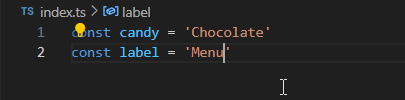
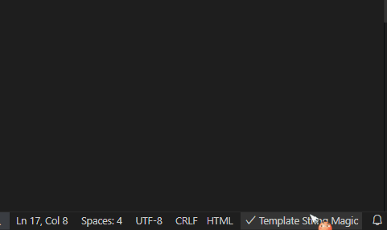

# Template String Magic

## Description

The "Template String Magic" extension for Visual Studio Code enhances your coding experience by automatically converting string literals with embedded expressions into template strings. This plugin increases productivity and reduces errors by providing seamless string manipulations directly within your code editor.

By default it will take effect on all files, you can specify that it will take effect on a particular file (please click on the lower right plus to add or remove), once a file is added, only these added file types will take effect

## Features

- **Automatic Conversion**: Automatically converts string literals with `${}` into template strings.
- **Smart String Detection**: Detects and converts only the appropriate string literals without affecting the rest of your code.
- **Cursor Positioning**: Maintains your cursor's position correctly after making conversions to ensure a smooth coding experience.

## Motive

Inspired by the [template-string-converter](https://github.com/meganrogge/template-string-converter) extension just to work around some bugs in [template-string-converter](https://github.com/meganrogge/template-string-converter), many of the bugs in [issues](https://github.com/meganrogge/template-string-converter/issues?q=is%3Aissue+is%3Aopen) are unfixed and using regular expression matching, there are issues with matching errors, so reimplementing these features using AST would be more Precise

## Installation

You can install the "Template String Magic" extension through the [Visual Studio Code Marketplace](https://marketplace.visualstudio.com/items?itemName=lete114.template-string-magic). Simply search for "Template String Magic" and click install.

## Usage

1. **Install the Extension**: Search for "Template String Magic" in the Visual Studio Code Marketplace and click install.
2. **Open a JavaScript/TypeScript File**: Open any JavaScript or TypeScript file in Visual Studio Code.
3. **Start Coding**: As you type and insert `${}` within string literals, the extension will automatically convert them into template strings.
4. **Enjoy Enhanced Productivity**: Experience seamless string manipulations and improved code readability.

## Contributing

Contributions are welcome! If you find any issues or have suggestions for improvements, please feel free to submit a pull request or open an issue on [GitHub](https://github.com/lete114/template-string-magic).

## License

This extension is licensed under the [MIT License](LICENSE).
